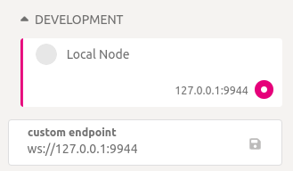
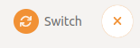

# Substrate contracts node

If you want to locally deploy and test your smart contract, then `substrate-contracts-node` by [Parity](https://www.parity.io/) will be one of the most useful tools for you!

## Description

So what `substrate-contracts-node` actually is? Long story short, it’s just a simple substrate node, that has useful pallets, 
such as `pallet-contracts`, `pallet-assets` etc., for smart contract development already enabled and some default accounts, 
like Alice, Bob and others with some amount of tokens inside. Also it has [pallet-assets-chain-extension](https://github.com/727-Ventures/pallet-assets-chain-extension), which is maintained 
by Brushfam team, enabled, so if you want to try testing your contract with [PSP22Pallet](https://github.com/727-Ventures/openbrush-contracts/tree/main/contracts/src/token/psp22_pallet) from [OpenBrush](/docs/openbrush), it will work just fine.

## Installation

So, to have substrate-contracts-node installed, you can try the following ways:

### Installation using cargo

Just use the following command in your terminal:

```shell
cargo install contracts-node --git https://github.com/paritytech/substrate-contracts-node.git
```

### Downloading the binary release

Check the [official releases page](https://github.com/paritytech/substrate-contracts-node/releases) of the tool and download the binary you need, after that you can run node via

```shell
./substrate-contracts-node
```

## Usage

### Run

So, to run the node if you have installed the binary release, you can use the command explained before, but if you installed it using cargo, you need to run the following command:

```shell
 substrate-contracts-node
```

### Run flags and runtime debugging

Also, you may need to know some useful flags that you can use while running the node:

- `--dev` By this flag you are specifying, that you are using the development chain
- `--tmp` This flag specifies that you are running the temporary node
- `--rpc-port` By default the node will be run on port 9933, but using this flag you can change it
- `--ws-port` By default the node will be run on port 9944, but using this flag you can change it

The other useful thing, is runtime debugging of your contract, to do this, you need to make some following steps:

- Use these two macros in your contracts’ code:

`ink::env::debug_println!`
`ink::env::debug_print!`

- You need to enable `ink-debug` feature for `ink_env` crate or just simply build your contract not in `release` mode.
- Run node using the following command:

```shell
substrate-contracts-node --dev -lerror,runtime::contracts=debug
```

By this, you are setting the log level of the node to debug mode.
Then, all the messages specified by macros, which are described before, will appear in your node logs.

### Polkadot.js usage

You can interact with your node using the [Polkadot.js](https://polkadot.js.org/apps) web UI.

- So, first of all you need to enter the UI by [this link](https://polkadot.js.org/apps)
- Then click on chain icon in upper left corner of UI

    
- Pick the development option, click on local node button, also you can change the port to the one, that your node is running on

    
- Click on switch button in upper left corner

    

And that’s it! Now UI is using your local node.
